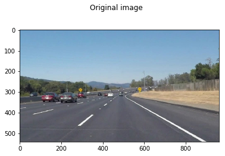
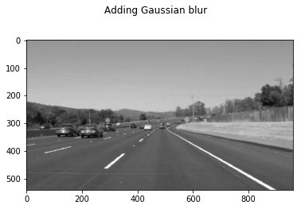
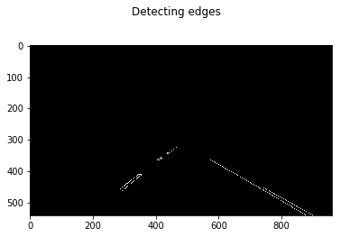
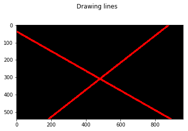
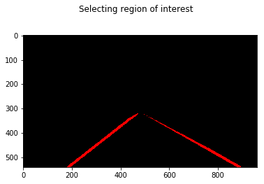
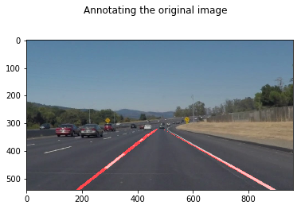

# **Finding Lane Lines on the Road**

## Overview

### This first project has been a great way to get one's feet wet. It was quite a surprise to realize that such a seemingly basic task such as detecting lane lines can be so challenging to solve properly.

---

**Finding Lane Lines on the Road**

The goals / steps of this project are the following:
* Make a pipeline that finds lane lines on the road
* Reflect on your work in a written report

---

### Reflection

### 1. Pipeline Description

My pipeline consisted of 5 steps. Starting with one of the provided images:

First, I converted the images to grayscale:

then I added Gaussian blur:

then I applied Canny edge detection and cleaned up my resulting edges by selecting only those in the region of interest:

after that, it was time to extract the two lane lines using Hough transforms:

then I trimmed the lines by only keeping the parts in the region of interest:

finally, the lane lines were ready to be used to annotate the original image:

In order to draw a single line on the left and right lanes, I modified the draw_lines() function by first separating the edges into the left and right lanes using their slopes and X coordinates (using both criteria helps weed out outliers), then fitting a line through each lane's group of points and finally extrapolating both lines to reach the edges of the image.

### 2. Identify potential shortcomings with your current pipeline

My current pipeline does a decent job but it does have a few glitches:
+ the lines seem to move slightly away from lanes towards the horizon,
+ in a couple of video frames, the lines get completely off target,
+ the pipeline does not generate well when the road is not straight, like in the challenge video.

### 3. Suggest possible improvements to your pipeline

A possible improvement would be to fit polynomial curves or some other smooth function with a small curvature to make the pipeline robust to turns in the road.
